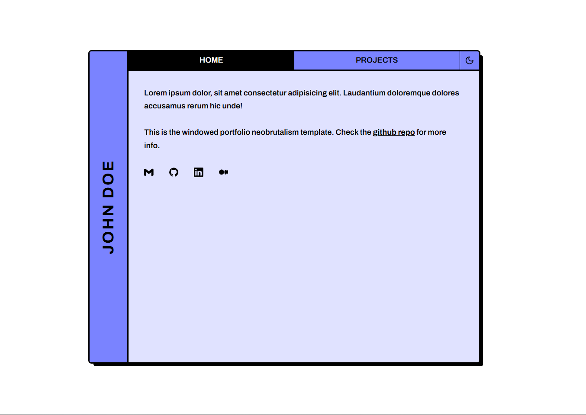

# Windowed portfolio

Windowed portfolio is a neobrutalism-styled nextjs tailwind template for portfolios.

## Get started

[Create a new repo](https://github.com/neobrutalism-templates/windowed-portfolio/generate) from this template.

### Installation

This template uses `pnpm` package manager so make sure you have it installed.

To install all dependencies run:

```bash
pnpm i
```

To run the app locally:

```bash
pnpm run dev
```

### Config

- Inside `layout.tsx` update the metadata
- Inside `page.tsx` update the content
- Update the `favicon.ico`

### Content config

#### Links on the home page

To update the links on the home page go to `src/app/page.tsx` and inside `links` array add or remove objects. Each object has 2 properties, `icon`, and `href`. `href` is self-explanatory, and inside `icon` you'll put an icon imported from `@icons-pack/react-simple-icons`. Visit [simpleicons.org](https://simpleicons.org/) to see all the icons. Import them by adding `Si` prefix to their name as I imported them in `links` component.

#### Updating the `previewImage` in `src/app/work/page.tsx`

Make sure to put `/` + name of the picture that's inside public folder. e.g. you have a `my-project.png` picture inside `public` folder, you'll type:

```ts
previewImage: '/my-project.png'
```

##### Image aspect ratio

Inside `app/work/page.tsx` `previewImage` is wrapped inside AspectRatio component. Change the `ratio` prop so it suits your needs (default preview images are 600 x 300, so I set the ratio to be `2 / 1`).

### Styling

To change the styling visit [styling docs](https://neobrutalism.dev/styling), and copy the desired styling to your css like it's shown in the styling docs.

I didn't add custom font weights for this template since I think it's best that way.
